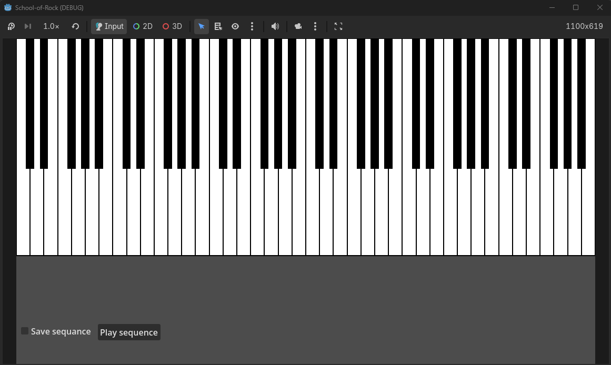

# CMPU1042-School-of-Rock-Project

This project is a 6-octave piano simulator that, when the checkbox is selected, begins recording the notes that have been played, users can then play back the sequence they have entered. 

Video of Piano

<video controls src="2026-04-28 11-26-20.mp4" title="Title"></video>